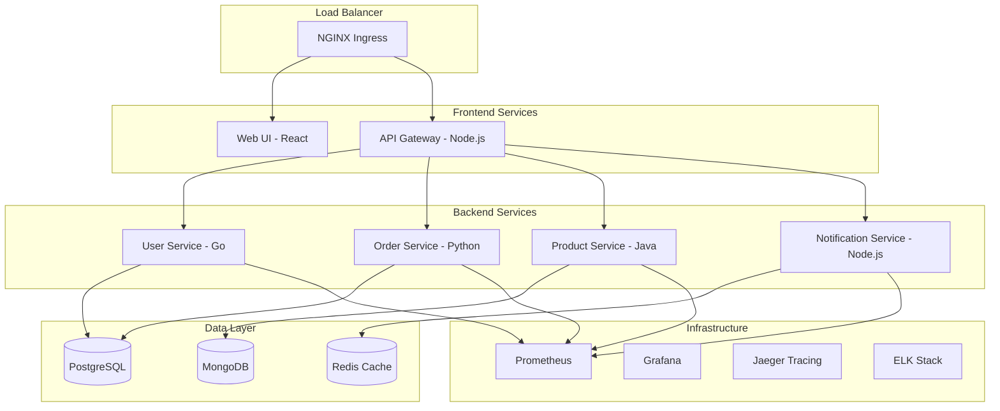

# Example: Microservices Platform

A complete microservices platform demonstrating modern DevOps practices including containerization, orchestration, monitoring, and CI/CD.

## 🏗️ Architecture

This example implements a production-ready microservices platform with the following components:



## 🚀 Quick Start

### Prerequisites
- Docker and Docker Compose
- kubectl (for Kubernetes deployment)
- 8GB+ RAM available
- Ports 80, 443, 3000, 9090 available

### Deploy with Docker Compose (Recommended for Development)

```bash
# Clone the repository
git clone https://github.com/your-repo/devops-excellence.git
cd devops-excellence/examples/microservices-platform

# Start all services
docker-compose up -d

# Check service status
docker-compose ps

# View logs
docker-compose logs -f
```

### Deploy to Kubernetes (Production)

```bash
# Apply Kubernetes manifests
kubectl apply -f k8s/namespace.yaml
kubectl apply -f k8s/

# Check deployment status
kubectl get pods -n microservices

# Get service URLs
kubectl get services -n microservices
```

## 📊 Service Overview

### Frontend Services

#### Web UI (React)
- **Port**: 3000
- **Technology**: React, TypeScript, Material-UI
- **Features**: 
  - Responsive design
  - Authentication
  - Real-time updates
  - Progressive Web App (PWA)

#### API Gateway (Node.js)
- **Port**: 8080
- **Technology**: Node.js, Express, JWT
- **Features**:
  - Request routing
  - Authentication/Authorization
  - Rate limiting
  - Request/Response transformation

### Backend Services

#### User Service (Go)
- **Port**: 8081
- **Technology**: Go, Gin, GORM
- **Database**: PostgreSQL
- **Features**:
  - User registration/authentication
  - Profile management
  - Role-based access control

#### Order Service (Python)
- **Port**: 8082
- **Technology**: Python, FastAPI, SQLAlchemy
- **Database**: PostgreSQL
- **Features**:
  - Order management
  - Payment processing
  - Order tracking
  - Event sourcing

#### Product Service (Java)
- **Port**: 8083
- **Technology**: Java, Spring Boot, JPA
- **Database**: MongoDB
- **Features**:
  - Product catalog
  - Inventory management
  - Search and filtering
  - Recommendations

#### Notification Service (Node.js)
- **Port**: 8084
- **Technology**: Node.js, Express, Socket.io
- **Database**: Redis
- **Features**:
  - Real-time notifications
  - Email/SMS delivery
  - Push notifications
  - Message queuing

### Infrastructure Services

#### Monitoring Stack
- **Prometheus**: Metrics collection (Port 9090)
- **Grafana**: Visualization dashboards (Port 3001)
- **Jaeger**: Distributed tracing (Port 16686)
- **AlertManager**: Alert management (Port 9093)

#### Logging Stack
- **Elasticsearch**: Search and analytics (Port 9200)
- **Logstash**: Log processing (Port 5044)
- **Kibana**: Log visualization (Port 5601)

## 🔧 Configuration

### Environment Variables

Each service can be configured using environment variables:

```bash
# Database Configuration
DB_HOST=postgres
DB_PORT=5432
DB_NAME=microservices
DB_USER=admin
DB_PASSWORD=secure_password

# Redis Configuration
REDIS_HOST=redis
REDIS_PORT=6379

# MongoDB Configuration
MONGO_HOST=mongodb
MONGO_PORT=27017
MONGO_DATABASE=products

# Service Discovery
API_GATEWAY_URL=http://api-gateway:8080
USER_SERVICE_URL=http://user-service:8081
ORDER_SERVICE_URL=http://order-service:8082
PRODUCT_SERVICE_URL=http://product-service:8083
NOTIFICATION_SERVICE_URL=http://notification-service:8084

# Monitoring
PROMETHEUS_URL=http://prometheus:9090
JAEGER_ENDPOINT=http://jaeger:14268/api/traces

# Security
JWT_SECRET=your-jwt-secret-key
ENCRYPTION_KEY=your-encryption-key
```

### Custom Configuration

1. **Development**: Copy `.env.example` to `.env` and modify values
2. **Production**: Use Kubernetes secrets and configmaps
3. **Testing**: Use `.env.test` for test configurations

## 🧪 Testing

### Unit Tests
```bash
# Test all services
./scripts/run-tests.sh

# Test specific service
docker-compose -f docker-compose.test.yml run user-service-test
```

### Integration Tests
```bash
# Run integration test suite
./scripts/integration-tests.sh

# Test API endpoints
./scripts/api-tests.sh
```

### Load Testing
```bash
# Install k6 load testing tool
brew install k6

# Run load tests
k6 run tests/load/api-load-test.js
```

## 📈 Monitoring and Observability

### Accessing Dashboards

After deployment, access the monitoring tools:

- **Application**: http://localhost:3000
- **API Gateway**: http://localhost:8080
- **Grafana**: http://localhost:3001 (admin/admin)
- **Prometheus**: http://localhost:9090
- **Jaeger**: http://localhost:16686
- **Kibana**: http://localhost:5601

### Key Metrics

#### Application Metrics
- Request rate (RPS)
- Response time percentiles
- Error rates
- Active users
- Business metrics (orders, revenue)

#### Infrastructure Metrics
- CPU and memory usage
- Disk I/O and network traffic
- Database performance
- Cache hit rates
- Queue lengths

### Alerts

Pre-configured alerts for:
- High error rates (>5%)
- Slow response times (>1s)
- Resource exhaustion (>80% CPU/Memory)
- Service downtime
- Database connection issues

## 🔒 Security Features

### Authentication & Authorization
- JWT-based authentication
- Role-based access control (RBAC)
- OAuth2/OpenID Connect integration
- API key management

### Data Protection
- Encryption at rest and in transit
- PII data masking
- Secure secret management
- GDPR compliance features

### Network Security
- Service mesh with mTLS
- Network policies
- API rate limiting
- DDoS protection

### Security Scanning
```bash
# Container vulnerability scanning
./scripts/security-scan.sh

# Dependency checking
./scripts/dependency-check.sh

# Static code analysis
./scripts/code-analysis.sh
```

## 🚢 Deployment Strategies

### Blue-Green Deployment
```bash
# Deploy to green environment
kubectl apply -f k8s/deployments/green/

# Switch traffic after validation
kubectl patch service api-gateway -p '{"spec":{"selector":{"version":"green"}}}'
```

### Canary Deployment
```bash
# Deploy canary version (10% traffic)
kubectl apply -f k8s/deployments/canary/

# Gradually increase traffic
kubectl patch virtualservice api-gateway --type merge -p '{"spec":{"http":[{"match":[{"headers":{"canary":{"exact":"true"}}}],"route":[{"destination":{"host":"api-gateway","subset":"canary"}}],"weight":20}]}}'
```

### Rolling Updates
```bash
# Update image version
kubectl set image deployment/user-service user-service=user-service:v2.0.0

# Monitor rollout
kubectl rollout status deployment/user-service

# Rollback if needed
kubectl rollout undo deployment/user-service
```

## 🔄 CI/CD Pipeline

### GitHub Actions Workflow

The platform includes a comprehensive CI/CD pipeline:

1. **Code Quality**
   - Linting and formatting
   - Unit test execution
   - Security scanning
   - Code coverage analysis

2. **Build & Package**
   - Docker image building
   - Multi-architecture builds
   - Image vulnerability scanning
   - Registry publishing

3. **Deploy & Test**
   - Staging deployment
   - Integration testing
   - Performance testing
   - Security testing

4. **Production Release**
   - Blue-green deployment
   - Health checks
   - Monitoring alerts
   - Rollback capabilities

### Pipeline Configuration

See `.github/workflows/microservices-ci.yml` for the complete pipeline configuration.

## 🛠 Development

### Local Development Setup

1. **Install Dependencies**
```bash
# Install development tools
./scripts/install-dev-tools.sh

# Set up development database
docker-compose -f docker-compose.dev.yml up -d postgres redis mongodb
```

2. **Run Services Locally**
```bash
# Start each service in development mode
cd services/user-service && go run main.go
cd services/order-service && python -m uvicorn main:app --reload
cd services/product-service && ./mvnw spring-boot:run
cd services/notification-service && npm run dev
```

3. **Hot Reload Development**
```bash
# Use development compose file with volume mounts
docker-compose -f docker-compose.dev.yml up
```

### Code Standards

- **Go**: Follow Go conventions, use gofmt and golint
- **Python**: PEP 8 compliance, use black formatter
- **Java**: Google Java Style Guide
- **JavaScript/TypeScript**: ESLint + Prettier
- **Docker**: Multi-stage builds, minimal base images
- **Kubernetes**: Resource limits, health checks, labels

## 📚 Documentation

### API Documentation
- **Swagger UI**: http://localhost:8080/docs
- **OpenAPI Spec**: Available at `/openapi.json`
- **Postman Collection**: `docs/postman-collection.json`

### Service Documentation
- [User Service API](./docs/user-service.md)
- [Order Service API](./docs/order-service.md)
- [Product Service API](./docs/product-service.md)
- [Notification Service API](./docs/notification-service.md)

### Architecture Documentation
- [System Design](./docs/system-design.md)
- [Database Schema](./docs/database-schema.md)
- [Event Flow](./docs/event-flow.md)
- [Security Model](./docs/security-model.md)

## 🔧 Troubleshooting

### Common Issues

#### Services Not Starting
```bash
# Check container logs
docker-compose logs service-name

# Check resource usage
docker stats

# Verify network connectivity
docker-compose exec service-name ping other-service
```

#### Database Connection Issues
```bash
# Check database status
docker-compose exec postgres pg_isready

# Verify credentials
docker-compose exec postgres psql -U admin -d microservices

# Reset database
docker-compose down -v && docker-compose up -d
```

#### Performance Issues
```bash
# Check metrics in Grafana
open http://localhost:3001

# View distributed traces in Jaeger
open http://localhost:16686

# Check resource limits
kubectl describe pod pod-name
```

### Debug Mode

Enable debug logging:
```bash
# Set debug environment variables
export LOG_LEVEL=debug
export DEBUG=true

# Restart services
docker-compose restart
```

## 🤝 Contributing

### Development Workflow
1. Fork the repository
2. Create feature branch
3. Implement changes with tests
4. Run quality checks
5. Submit pull request

### Testing Guidelines
- Write unit tests for all new code
- Include integration tests for API changes
- Update documentation for user-facing changes
- Ensure all CI checks pass

### Code Review Checklist
- [ ] Code follows project standards
- [ ] Tests are included and passing
- [ ] Documentation is updated
- [ ] Security considerations addressed
- [ ] Performance impact evaluated

## 📊 Performance Benchmarks

### Expected Performance
- **API Gateway**: 10,000+ RPS
- **User Service**: 5,000+ RPS
- **Order Service**: 3,000+ RPS
- **Product Service**: 8,000+ RPS
- **Notification Service**: 15,000+ RPS

### Load Test Results
Regular load testing ensures performance standards:
- 99th percentile response time < 500ms
- 95th percentile response time < 200ms
- Error rate < 0.1%
- System stable under 2x expected load

## 📈 Scalability

### Horizontal Scaling
All services support horizontal scaling:
```bash
# Scale services
kubectl scale deployment user-service --replicas=5
kubectl scale deployment order-service --replicas=3
```

### Auto-scaling
```bash
# Enable Horizontal Pod Autoscaler
kubectl apply -f k8s/hpa/
```

### Database Scaling
- Read replicas for PostgreSQL
- Redis cluster for caching
- MongoDB sharding for products

---

This microservices platform example demonstrates enterprise-grade DevOps practices and can serve as a foundation for real-world applications. Start with the docker-compose deployment and gradually move to Kubernetes as you become more comfortable with the architecture.
