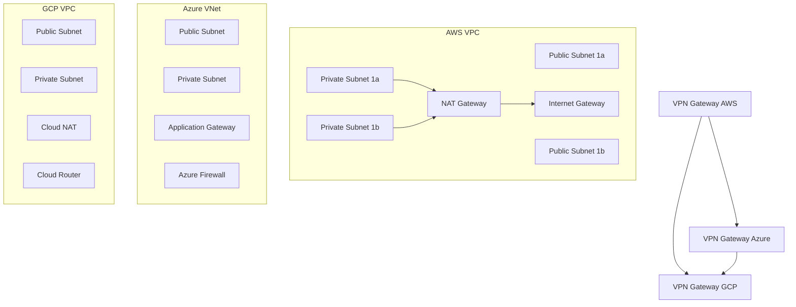

# Multi-Cloud VPC Module

A production-ready Terraform module for creating consistent Virtual Private Cloud (VPC) infrastructure across AWS, Azure, and Google Cloud Platform.

## Features

- **Multi-Cloud Support**: Unified interface for AWS, Azure, and GCP
- **Consistent Architecture**: Standardized subnet layouts and security configurations
- **Cross-Cloud Connectivity**: VPN tunnels and peering connections
- **Security Hardened**: Default security groups and network ACLs
- **Highly Available**: Multi-AZ deployment patterns
- **Cost Optimized**: Right-sized resources with auto-scaling

## Architecture



## Usage

### Basic Multi-Cloud VPC

```hcl
module "multi_cloud_vpc" {
  source = "./modules/networking/multi-cloud-vpc"
  
  # Common configuration
  project_name = "my-project"
  environment  = "production"
  
  # CIDR blocks (non-overlapping)
  aws_cidr   = "10.0.0.0/16"
  azure_cidr = "10.1.0.0/16"
  gcp_cidr   = "10.2.0.0/16"
  
  # Cloud provider specific settings
  aws_region    = "us-west-2"
  azure_region  = "West US 2"
  gcp_region    = "us-west2"
  
  # Features
  enable_vpn_connections = true
  enable_monitoring      = true
  enable_flow_logs       = true
  
  # Security
  allowed_ssh_cidrs = ["203.0.113.0/24"]
  
  tags = {
    Environment = "production"
    Team        = "platform"
    CostCenter  = "engineering"
  }
}
```

### Advanced Configuration with Custom Subnets

```hcl
module "enterprise_vpc" {
  source = "./modules/networking/multi-cloud-vpc"
  
  project_name = "enterprise-platform"
  environment  = "production"
  
  # Custom subnet configuration
  aws_subnets = {
    public = {
      "us-west-2a" = "10.0.1.0/24"
      "us-west-2b" = "10.0.2.0/24"
    }
    private = {
      "us-west-2a" = "10.0.10.0/24"
      "us-west-2b" = "10.0.20.0/24"
    }
    database = {
      "us-west-2a" = "10.0.50.0/24"
      "us-west-2b" = "10.0.60.0/24"
    }
  }
  
  # Enhanced security
  enable_waf                = true
  enable_ddos_protection   = true
  enable_private_dns       = true
  
  # Compliance
  enable_encryption_at_rest    = true
  enable_encryption_in_transit = true
  compliance_framework         = "SOC2"
  
  # Monitoring and logging
  log_retention_days = 90
  enable_cloudtrail  = true
  enable_guardduty   = true
}
```

## Inputs

| Name | Description | Type | Default | Required |
|------|-------------|------|---------|:--------:|
| project_name | Name of the project | `string` | n/a | yes |
| environment | Environment name (dev, staging, prod) | `string` | n/a | yes |
| aws_cidr | CIDR block for AWS VPC | `string` | `"10.0.0.0/16"` | no |
| azure_cidr | CIDR block for Azure VNet | `string` | `"10.1.0.0/16"` | no |
| gcp_cidr | CIDR block for GCP VPC | `string` | `"10.2.0.0/16"` | no |
| enable_vpn_connections | Enable VPN connections between clouds | `bool` | `false` | no |
| enable_monitoring | Enable monitoring and alerting | `bool` | `true` | no |
| allowed_ssh_cidrs | CIDR blocks allowed for SSH access | `list(string)` | `[]` | no |

## Outputs

| Name | Description |
|------|-------------|
| aws_vpc_id | ID of the AWS VPC |
| aws_public_subnet_ids | IDs of AWS public subnets |
| aws_private_subnet_ids | IDs of AWS private subnets |
| azure_vnet_id | ID of the Azure Virtual Network |
| azure_subnet_ids | IDs of Azure subnets |
| gcp_vpc_id | ID of the GCP VPC |
| gcp_subnet_ids | IDs of GCP subnets |
| vpn_gateway_ips | IP addresses of VPN gateways |

## Security Features

### Network Security
- **Default Deny**: All traffic denied by default
- **Principle of Least Privilege**: Minimal required access only
- **Encryption**: All traffic encrypted in transit
- **Segmentation**: Proper network segmentation between tiers

### Access Control
- **RBAC Integration**: Role-based access control
- **MFA Required**: Multi-factor authentication for admin access
- **Audit Logging**: Comprehensive audit trails
- **Regular Rotation**: Automated credential rotation

### Compliance
- **SOC 2 Type II**: Security controls for SOC 2 compliance
- **PCI DSS**: Payment card industry compliance
- **GDPR**: Data protection regulation compliance
- **HIPAA**: Healthcare data protection (optional)

## Monitoring and Alerting

### Metrics Collected
- Network throughput and latency
- VPN tunnel health and utilization
- Security group rule violations
- Cost and resource utilization

### Default Alerts
- VPN tunnel down
- Unusual network traffic patterns
- Security group violations
- High data transfer costs

### Dashboards
- Network topology overview
- Cross-cloud connectivity status
- Security and compliance metrics
- Cost optimization recommendations

## Disaster Recovery

### Backup Strategy
- **Configuration Backup**: Automated Terraform state backup
- **Network Topology**: Documented network architecture
- **Recovery Procedures**: Step-by-step recovery guides

### Recovery Objectives
- **RTO**: 4 hours for full network restoration
- **RPO**: 1 hour for configuration data
- **MTTR**: 30 minutes for common issues

## Cost Optimization

### Automated Cost Controls
- **Resource Tagging**: Comprehensive cost allocation
- **Right-Sizing**: Automated recommendations
- **Reserved Instances**: Optimal reserved capacity planning
- **Unused Resources**: Automated cleanup of unused resources

### Cost Monitoring
- Daily cost reports
- Budget alerts and thresholds
- Cross-cloud cost comparison
- Optimization recommendations

## Examples

See the [examples](./examples/) directory for:
- **Basic Setup**: Simple multi-cloud VPC
- **Enterprise**: Full-featured enterprise deployment
- **Development**: Minimal cost development environment
- **Disaster Recovery**: DR-focused configuration

## Testing

```bash
# Run validation tests
terraform plan -var-file="test/test.tfvars"

# Run security scan
checkov -f main.tf

# Run compliance check
terraform-compliance -f compliance/ -p plan.out
```

## Troubleshooting

### Common Issues

1. **VPN Connection Failures**
   - Check security group rules
   - Verify routing tables
   - Confirm pre-shared keys

2. **Cross-Cloud Connectivity**
   - Validate CIDR block overlaps
   - Check DNS resolution
   - Verify firewall rules

3. **High Data Transfer Costs**
   - Review traffic patterns
   - Optimize data placement
   - Consider dedicated connections

### Support

- **Documentation**: [Detailed guides](./docs/)
- **Examples**: [Working examples](./examples/)
- **Issues**: [GitHub Issues](https://github.com/your-repo/issues)
- **Community**: [Slack Channel](https://slack.your-community.com)

## Contributing

1. Fork the repository
2. Create a feature branch
3. Add tests for new functionality
4. Update documentation
5. Submit a pull request

## License

This module is licensed under the MIT License. See [LICENSE](LICENSE) for details.
